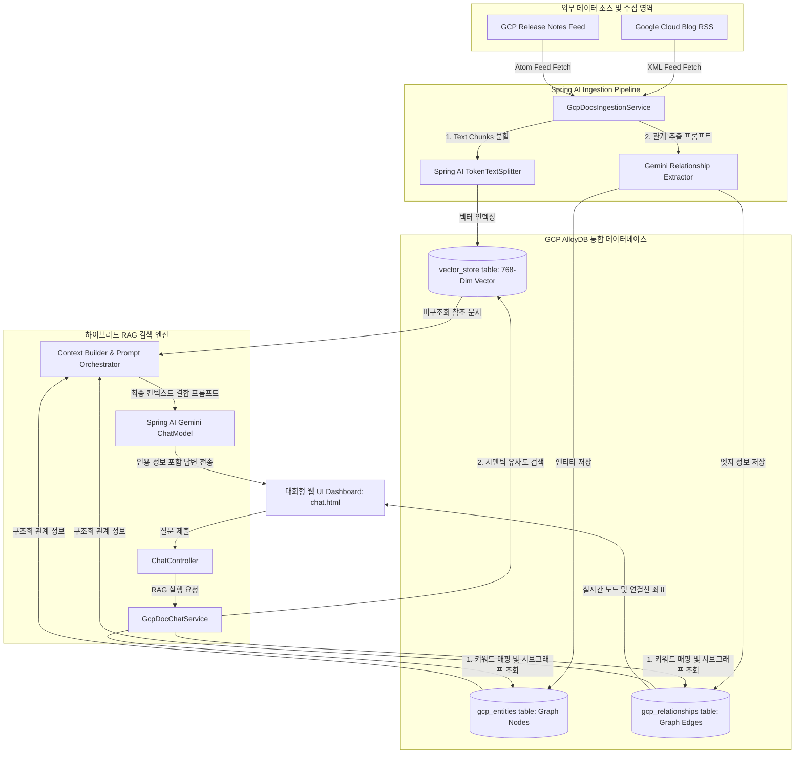

# 🏛️ 서비스 아키텍처 및 데이터 흐름 (Architecture)

GCP Documentation RAG Chatbot은 완전관리형 GCP 인프라와 표준 Spring AI 추상화 구조를 긴밀하게 연결하는 신뢰도 높은 아키텍처를 가집니다.

---

## 🏗️ 시스템 아키텍처 다이어그램 (Architecture Diagram)

---

## 🔌 주요 컴포넌트 레이어 (Component Layers)

### 1. Ingestion Layer
- **Crawler**: Jsoup을 이용해 각 사이트의 최신 업데이트 피드를 동기화합니다.
- **Spring AI Splitter**: 토큰 경계를 초과하지 않고 정교한 컨텍스트 정보를 유지하기 위해 `TokenTextSplitter`를 장착해 분할을 제어합니다.
- **Graph Extractor**: 글 본문에서 유의미한 상관관계를 추출하기 위해 특화 추출 프롬프트를 내재한 Gemini 가동 흐름을 추가하였습니다.

### 2. Storage Layer (AlloyDB)
- **Vector Space**: `vector_store` 테이블을 연동하여, Spring AI `PgVectorStore`에 최적화된 스키마 구조로 768차원 임베딩 정보를 완벽하게 색인합니다.
- **Relational Graph Space**: 지식 그래프 개체들과 연결고리 속성들을 보관하기 위해 외래키 기반 조인이 가능하도록 `gcp_entities` 및 `gcp_relationships` 테이블 구조를 정의하였습니다.

### 3. Core RAG Retrieval Layer
- **Concept Matcher**: 사용자의 프롬프트를 실시간 스캔하여 지식 노드 명칭(예: `AlloyDB`, `Cloud Run`)이 발각되는 즉시 이들과 연동된 모든 그래프 관계 데이터를 추출합니다.
- **Vector Searcher**: 시맨틱 거리를 기반으로 가장 유사도가 높은 참조 문서 본문 블록 4개를 동시 병렬 수집합니다.
- **Context Orchestrator**: 지식 구조(정형)와 참조 본문 블록(비정형)을 하나의 시스템 프롬프트 포맷으로 정교하게 감싸 챗 모델에 전달함으로써 할루시네이션을 억제하고 답변의 완결성을 보장합니다.
